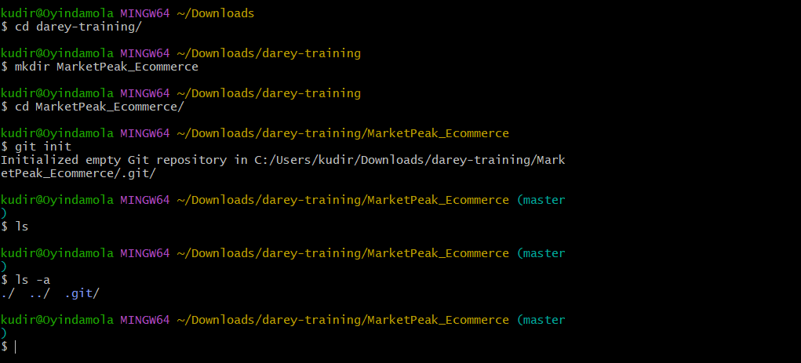

# Introduction to Cloud Computing.
## PROJECT 3: MarketPeak E-Commerce Website Deployment.

This project involves developing a version control system using Git, develop the website on a linux environment and deploy it on an AWS EC2 instance.

I have been assigned to develop an e-commerce website for a new online marketplace named `MarketPeak`. The website template I used was gotten from toolplate.

## NOW LET'S DIVE INTO HOW THIS PROJECT WAS DONE

## Implement Version Control with Git.
### 1. Initialized the Git repository: 
I created a project directory names `MarketPeak_Ecommerce`. In this directory, i initialized a git repositoy to manage the version control using `git init`.

```bash
mkdir MarketPeak_Ecommerce
cd MarketPeak_Ecommerce
git init
```


### 2. Downloading the E-Commerce WEbsite.
Instead of developing a website from scratch. I used a pre-existing e-commerce website template. I am mainly focusing on `deployment` and `operational` aspects rather than web development as a DevOps engineer.

* Downloaded an Ecommerce template from [toolplate](https://www.tooplate.com/view/2114-pixie).
* Extracted the downloaded template into the project directory. `MarketPeak_Ecommerce`


### 3. Stage, Commit and Push the Template to Github repository.
 Each of the files in the websites were added to the git repo.
 Git global configuration was set with my username and email
 and changes where commited.
 ```bash
 git add .
 git config --global user.name "MyUserName"
 git config --global user.email "myemail@example.com"
 git commit -m "Initial commit with basic e-commerce site structure"
 ```
 

 * Next step is to push the code to a remote Github repo. This step is very crucial for `version control and collaboration`.
 * Create a remote repository on Github names `MarketPeak_Ecommerce`

  

* Link the Local repository to github on the terminal and push the code.
```bash
git remote add origin https://github.com/your-git-username/MarketPeak_Ecommerce.git
git push -u origin main
```


## AWS Deployment:
### 1. Setting Up an AWS EC2 Instance. 
* Log in to the AWS Management Console.
* Launch an EC2 instance using Amazon Linux AMI.


* Connect to the instance using SSH.


### 2. Cloning the repo on the Linux Server.
Before deploying the e-commerce platform, we need to clone the Github Repository to thr AWS Ec2 Instance created. 
This process involves authenticating with Github and choosing between 2 primary methods of cloning a repository. `SSH` and `HTTPS`.
```bash
git clone https://github.com/yourusername/MarketPeak_Ecommerce.git
```


### 3. Install a Web Server on EC2.
We will be installing the Apache HTTPS Server(httpd).
This is a widely used web server that serves HTML files and content over the internet. Installing it will allow me to host MarketPeak E-commerce site.

```bash
sudo yum update -y
sudo yum intall httpd -y
sudo systemctl start httpd
sudo sytemctl enable httpd
```
`sudo yum update -y` : this updates the linux server.

`sudo yum install https -y` : installs httpd (Apache).

`sudo systemctl start httpd` : starts the web server.

`sudo ststemctl enable httpd` : ensures it automatically starts on server boot.

### 4. Configure httpd for Website
To be able to serve the website from the EC2 instance, we have to configure the httpd to point to the directory on the linux server where the website code files are stored.

It's usually in `/var/www/html`. This directory is a standard directory structure on Linux systems that host web content, particularly for Apache HTTP Server. 
Thus directory is automatically created when Apache is installed on the system.

```bash
sudo rm -rf /var/www/html/*
sudo cp -r ~/MarketPeak_Ecommerce/* /var/www/html/
```
To reload httpd when changes have been applied.
```bash
sudo systemctl reload httpd
```


### 5. Access Website from Browser.
To confirm the httpd was configured properly and the websites files were kept in place, we have to open the web browser using the Public IP of your EC2 instance. This views the deployed website.


## Continuous Integration and Deployment Workflow
This part makes us ensure a smooth workflow for developing, testing and deploying the e-commerce platform. 

Here we will be creating a new branch, adding changes to the website and pushing the changes to the new branch. 

### 1. Developing a new branch and make changes.
I created a development branch and switched to the new branch.
```bash
git branch development
git checkout development
```
Here I created a new html file called `cart.html` and added content to the file.
Also added the `Cart` bar to the navbar of each of the other existing html files.
```bash
vi cart.html
```

### 2. Version Control with Git.
Here we will stage, commit and push our changes to the development branch.
```bash
git add .
git commit -m "Add new features"
git push origin development
```


### 3. Creating pull requests and merging into main branch
Pull requests is crucial for code review. Reviewing changes on development branch for any errors.
After review, the PR can be merged with the main branch, this incorporates the new features into the production codebase.
The merged changes will be pushed to github.
```bash
git checkout main
git merge development
git push origin main
```


### 4. Deploying the Uodates to the Production server.
We have to pull the latest changes on the server.
and restart the web server to apply the changes.
```bash 
git pull origin main
sudo systemctl reload httpd
```
### 5. Testing the new changes
Access the website by opening the browser and navigate to the public IP address of the EC2 instance. Test to ensure new features are working properly.
* The `cart.html` file is reflecting when we load the public IP address.


## THIS WORKFLOW EMPHASIZES BEST PRACTICES IN SOFTWARE DEVELOPMENT AND DEPLOYMENT, INCLUDING BRANCH MANAGEMENT, CODE REVIEW THROUGH PULL REQUESTS, AND CONTINUOUS INTEGRATION/DEPLOYMENT STRATEGIES. 

